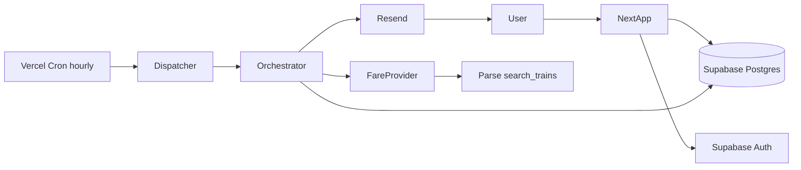
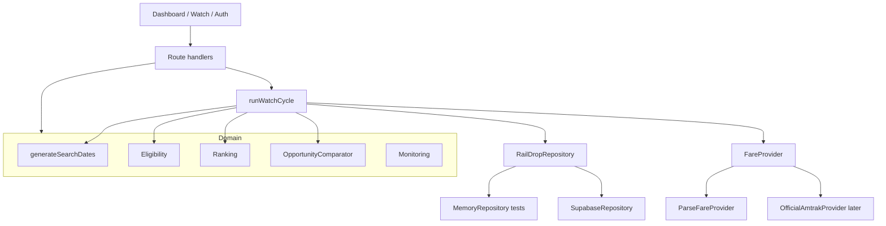
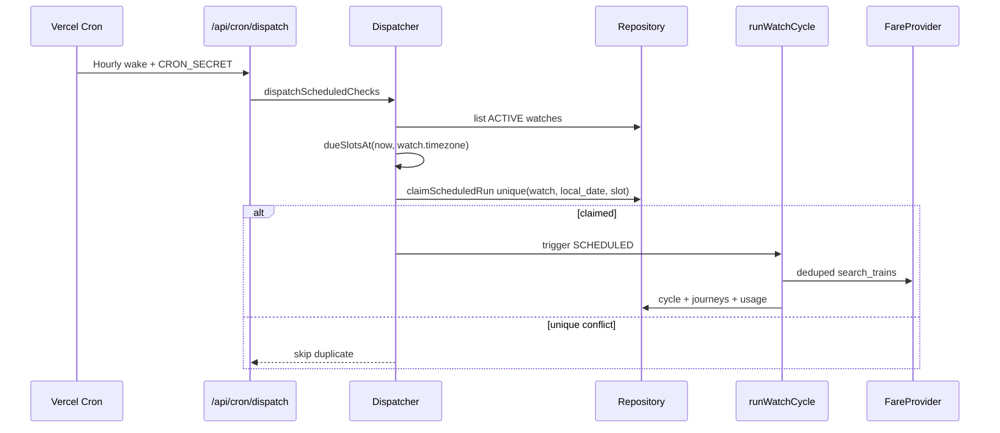
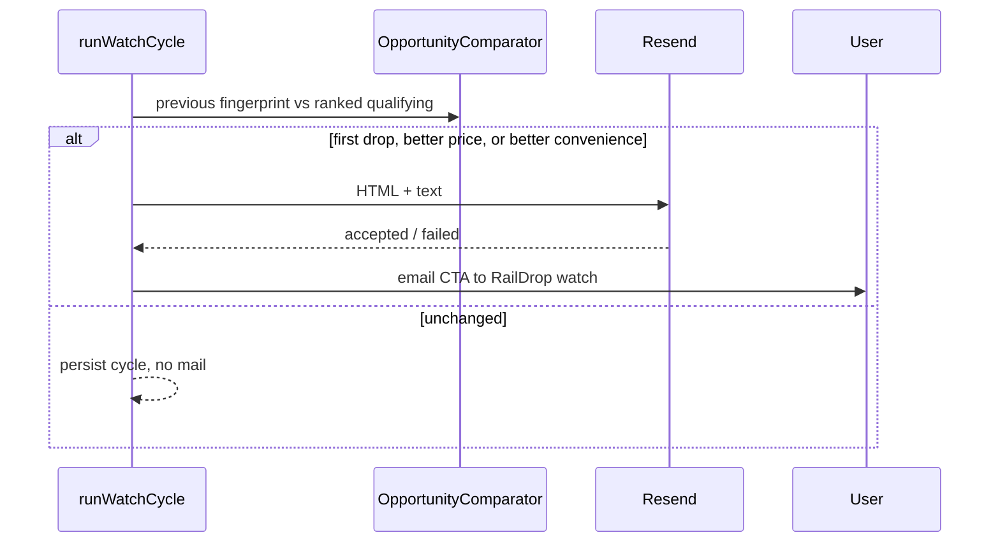

# RailDrop architecture

RailDrop is a Next.js App Router product that watches Amtrak fares after a traveler has already booked. The application owns dates, ranking, alerts, and booking handoff. Parse’s `amtrak-com-api` is an interchangeable fare source.

## System overview



## Component diagram



## Data flow

1. User creates a watch with origin, destination, desired date `D`, flexibility, and the actual booked total in cents.
2. `generateSearchDates` produces the canonical window: `D-flexibility … D+flexibility`, skipping past dates.
3. `runWatchCycle` with trigger `INITIAL` searches each remaining date through `FareProvider.searchTrips`.
4. Identical `provider:origin:destination:date:A{n}` keys reuse a fresh result for the cycle.
5. Journeys are normalized into `JourneyOption` / `FareOption` domain objects.
6. Eligibility keeps Flexible + requested class by default; Thruway/bus is opt-in.
7. Ranking sorts the entire window by lowest party total, then date proximity, preferred time, transfers, duration, Flexible preference.
8. `OpportunityComparator` decides whether to email.
9. Dashboard reads the latest cycle, not individual provider calls.

## Scheduled check sequence



The hourly wake does **not** search fares. It only asks whether 08:00 / 14:00 / 20:00 local wall time has already arrived in the watch timezone. DST is handled by `Intl` + IANA zones, never fixed UTC offsets.

## Alert sequence



## Scheduler design

- Logical slots: `MORNING` 08:00, `AFTERNOON` 14:00, `EVENING` 20:00.
- Catch-up: any hourly wake after a slot hour claims that slot if the unique row is missing and the local date is still today.
- Manual `Check now` is `MANUAL` and does not consume a slot.
- Initial create is `INITIAL` and is accounted separately in usage.

## Provider abstraction

```ts
interface FareProvider {
  searchTrips(request: FareSearchRequest): Promise<FareSearchResult>;
  getStations(): Promise<Station[]>;
  healthCheck(): Promise<{ ok: boolean; message: string; latencyMs: number }>;
}
```

Production provider: `ParseFareProvider` calling

`POST https://api.parse.bot/scraper/f800c27d-0aaa-4ca0-864e-4dc69e20f764/search_trains`

with `origin`, `destination`, `departure_date`, `num_adults`. Credits: 2 per successful call, configurable via `PROVIDER_CREDITS_PER_SEARCH`.

Normalization is isolated in `parse-normalizer.ts`. The rest of RailDrop never stores Parse JSON as its working model.

## Booking handoff

`BookingLinkResolver` order:

1. Provider-supplied HTTPS booking URL for the itinerary, if present.
2. No official, documented, stable Amtrak search deep link was verified. Do not invent query-string booking URLs.
3. Fallback: official Amtrak home (`https://www.amtrak.com/home.html`) plus copyable itinerary details.

A generic Amtrak URL is labeled as a handoff, never as an exact fare deep link.

## Schema rationale

Tables follow the product nouns: `watches`, `fare_check_cycles`, `fare_snapshots` (per date), `journey_options`, `provider_requests`, `scheduled_check_runs`, `alerts`, `notification_deliveries`, `booking_price_events`, `stations`, `provider_usage_daily`.

A cycle is one logical refresh of the whole window. Snapshots keep per-date success vs empty inventory vs provider failure.

`search_cache` stores normalized journeys for a short freshness window so overlapping watches share one external search.

## Idempotency model

`scheduled_check_runs (watch_id, local_check_date, check_slot)` is unique. Concurrent cron deliveries, retries, and overlapping deploys lose the insert and skip.

Provider retries are bounded (3) with jitter and only for 429 / 5xx / explicit retryable errors. 401 / 400 / 422 are not retried.

## Cost model

Default ±1 watch = 3 `search_trains` per cycle. Three scheduled cycles = 9 successful calls/day before cross-watch dedup. Credits are configuration, not constants in ranking logic. Settings shows daily usage and warns when `credits_today * 30` exceeds `PROVIDER_MONTHLY_CREDIT_BUDGET`.

Completed and paused watches are not dispatched.

## Failure matrix

| Situation                  | Cycle status               | UI                              | Alert                      |
| -------------------------- | -------------------------- | ------------------------------- | -------------------------- |
| All dates return journeys  | `SUCCESS`                  | Cheapest in window              | If opportunity is new      |
| Mix of success and timeout | `PARTIAL_SUCCESS`          | Best found + failed dates named | Allowed, copy is qualified |
| All dates fail             | `PROVIDER_ERROR`           | Fare data unavailable           | No                         |
| All dates empty            | `NO_AVAILABLE_ITINERARIES` | No cheaper fare yet             | No                         |
| Price semantics unknown    | Fare excluded              | Not ranked                      | Never                      |

Zero inventory is not an API failure.

## Security boundaries

- Browser: anon Supabase key only.
- Server: service role, `PARSE_API_KEY`, `RESEND_API_KEY`, `CRON_SECRET`.
- RLS: users read only their watches and child rows.
- Stations are public reference data.
- Logs redact secret-like keys.
- No reservation numbers, cards, or Amtrak passwords.
- `E2E_TEST=1` is refused when `NODE_ENV` or `VERCEL_ENV` is production.
- Missing `PARSE_API_KEY` disables search. It never enables fixture data in production.

## Deployment

- App: Vercel (or any Next host) with `vercel.json` hourly cron.
- Database + Auth: Supabase.
- Email: Resend.
- Local/E2E: `MemoryRepository` + `FixtureFareProvider` only when `E2E_TEST=1`.
